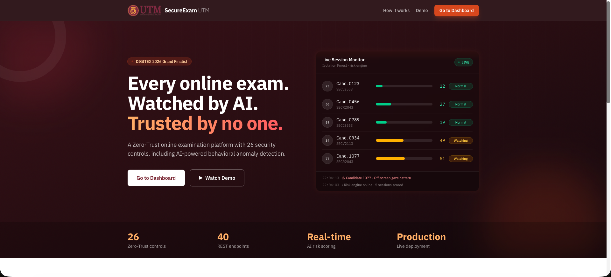
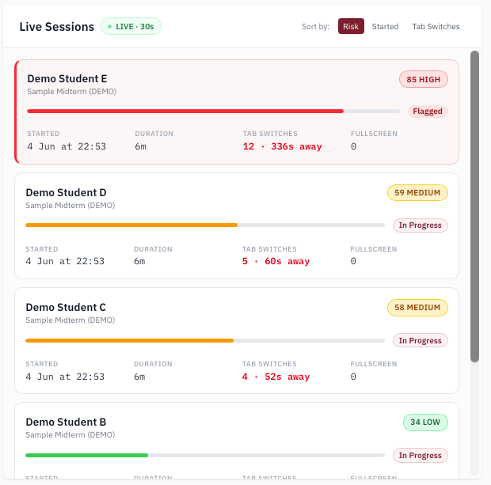
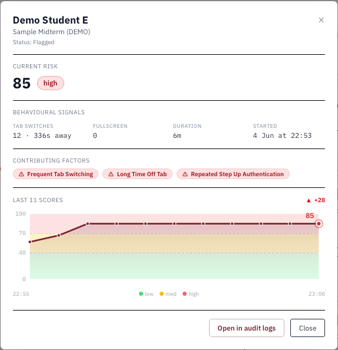
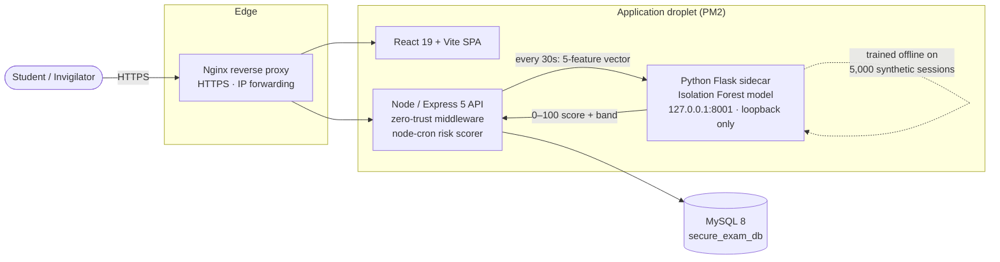

<div align="center">

# 🛡️ SecureExam UTM

### A Zero-Trust Online Examination Platform with AI Behavioral Anomaly Detection

*Final Year Project · Faculty of Computing, Universiti Teknologi Malaysia*
*DIGITEX 2026 Grand Finalist*

[](https://secureexam-cqy.tech)
[](https://youtu.be/nyrsI8Op4BY)


</div>

> **SecureExam UTM** secures remote and on-campus examinations under a **zero-trust** security model — every request is authenticated, authorized, and *continuously* verified; no session is trusted by default. On top of 25 zero-trust controls, its headline feature (**Control #26**) is a live **behavioral risk-scoring engine** that flags anomalous exam sessions in real time for human invigilators — without ever acting autonomously against a student.

---

## 📑 Table of Contents

- [Demo](#-demo)
- [Problem & Objectives](#-problem--objectives)
- [Key Features](#-key-features)
- [The 26 Zero-Trust Controls](#-the-26-zero-trust-controls)
- [Architecture](#-architecture)
- [Behavioral Risk Scoring (Control #26)](#-behavioral-risk-scoring-control-26)
- [Tech Stack](#-tech-stack)
- [Repository Structure](#-repository-structure)
- [Getting Started](#-getting-started)
- [Deployment](#-deployment)
- [Scope & Future Work](#-scope--future-work)
- [Academic Context](#-academic-context)

---

## 🎬 Demo

<div align="center">

[](https://youtu.be/nyrsI8Op4BY)

*▲ Click to watch the 1-minute walkthrough · or explore the [live site](https://secureexam-cqy.tech)*

</div>

| Public landing page | Invigilator monitoring | Per-session risk modal |
|:---:|:---:|:---:|
|  |  |  |

---

## 🎯 Problem & Objectives

**Problem.** Online and hybrid examinations are increasingly common, but traditional proctoring is either invasive (continuous webcam surveillance), expensive (human-per-student), or trivially bypassed (a single login check that trusts the session forever). The integrity gap is *between* login and submission — where coercion, account sharing, and unauthorized assistance actually happen.

**Approach.** Apply a **zero-trust** posture — *never trust, always verify* — to the exam session itself, and add a **continuous, advisory** layer of behavioral anomaly detection so that integrity is re-evaluated throughout the exam, not just at the door.

**Objectives.**

1. Enforce explicit verification at every step (MFA, JWT with IP pinning, role-based access, session re-verification on resume).
2. Lock down the exam environment (fullscreen enforcement, tab-switch and heartbeat telemetry) without invasive surveillance.
3. Detect behavioral anomalies in real time using an unsupervised ML model trained **only on synthetic data**.
4. Keep humans in the loop — the system *advises* invigilators and never takes autonomous action against a student.
5. Ship a production-grade, deployable system (not a prototype) demonstrable on a public URL.

---

## ✨ Key Features

- 🔐 **Zero-trust middleware** — JWT auth with IP pinning behind an Nginx reverse proxy; every request re-verified.
- 📱 **Multi-factor authentication** — TOTP-based MFA with QR enrollment (`speakeasy` + `qrcode`).
- 👥 **Role-based access** — `student`, `lecturer`, `admin`, `staff`, each with a dedicated dashboard.
- 🖥️ **Locked-down exam room** — fullscreen enforcement, tab-switch tracking, heartbeat telemetry, resume verification.
- 📡 **Live invigilator monitoring** — active sessions, alerts, and per-session risk history with sparklines.
- 🧠 **Behavioral risk scoring (Control #26)** — an Isolation Forest scores every active session every 30 s on five behavioral features and surfaces anomalies to invigilators.
- 📝 **Audit logging** — security-relevant events recorded and reviewable.
- 🌐 **Public landing page** — animated AI risk-monitor demo as the entry route.

---

## 🔒 The 26 Zero-Trust Controls

The platform implements zero-trust controls across five categories, capped by **Control #26** — the AI behavioral layer that is this project's primary contribution.

| Category | Focus |
|---|---|
| 🔑 **Authentication** | MFA (TOTP), password hashing (bcrypt), JWT issuance & IP pinning |
| ⏱️ **Session** | Session lifecycle, resume verification, server-side heartbeat, auto-sweep of stale sessions |
| 🖥️ **Browser lockdown** | Fullscreen enforcement, tab-switch detection, focus/visibility telemetry |
| 👥 **RBAC** | Least-privilege role checks on every protected route |
| 📋 **Audit & detection** | Activity logging, flagged-activity capture, audit-log review |
| 🧠 **Control #26 — Continuous Behavioral Verification** ⭐ | Real-time, *advisory* anomaly scoring of every active session |

> Detailed control-by-control mapping with source pointers lives in [`backend/CONTROL_MAPPING.md`](backend/CONTROL_MAPPING.md). Control #26 is fully documented there; the earlier controls are currently summarized by category.

---

## 🏗️ Architecture



The Python ML service is **never exposed via Nginx** — it binds to loopback only, behind three independent guards (loopback bind, Flask `before_request` origin check, OS-level UFW deny on port 8001). If it is unreachable, the API logs a warning and serves exams normally: **scoring is best-effort and never on the exam critical path.**

---

## 🧠 Behavioral Risk Scoring (Control #26)

The project's core research contribution: **continuous, advisory anomaly detection** that re-evaluates every active session every 30 seconds.

**How it works.** A `node-cron` job lists every in-progress/flagged session, extracts **five behavioral features** from existing activity tables (no new telemetry collected), and `POST`s the vector to the localhost Flask service:

```
tab_switches · total_tab_duration_sec · mfa_reprompts · heartbeat_count · session_resumes
```

The service runs the vector through an **Isolation Forest** and returns a **0–100 risk score**, a band (`low` / `medium` / `high`), and rule-based contributing factors, stored in `SessionRiskScore` and surfaced in the monitoring dashboard.

**Scoring methodology.** The score combines two signals:

1. A **sigmoid base** over the Isolation Forest `decision_function` — the model's anomaly-direction signal.
2. A **magnitude-calibration overlay** — a deterministic per-feature contribution scaled by excess past the training-time p95, capped at 40 points. This was a *documented architectural deviation*: it defeats Isolation Forest's path-length saturation, which otherwise made `tab_switches=15` and `tab_switches=30` score nearly identically. The overlay restores a usable medium→high gradient so catastrophic sessions are visibly distinguishable from merely anomalous ones.

**Ethics & evaluation.**

- 🧪 **Synthetic data only** — the model is trained on 5,000 analytically generated sessions. Real student data is *never* used for training, under any circumstance.
- 🙋 **Advisory only** — scores inform invigilators; the system never auto-flags, auto-submits, or otherwise acts against a student. Humans make every enforcement decision.
- 🕶️ **Invigilator-only by design** — students see no risk indicator; there is no student-facing behavioral nudge.

See [`backend/risk-scoring/README.md`](backend/risk-scoring/README.md) for the full scoring formula, thresholds, and feature definitions, and [`backend/risk-scoring/DEPLOYMENT.md`](backend/risk-scoring/DEPLOYMENT.md) for the production runbook.

---

## 🧰 Tech Stack

| Layer | Technology |
|---|---|
| **Frontend** | React 19, Vite, React Router 7, Tailwind CSS v4 |
| **Backend** | Node.js, Express 5, JWT, bcryptjs, helmet, express-rate-limit, node-cron |
| **Database** | MySQL 8 (`mysql2`) |
| **Auth / MFA** | `jsonwebtoken`, `speakeasy` (TOTP), `qrcode` |
| **ML service** | Python, Flask, scikit-learn (Isolation Forest) |
| **Ops** | PM2, Nginx, DigitalOcean droplet |

---

## 📁 Repository Structure

```
backend/
  config/            # DB connection + schema.sql … schema_v5.sql migrations, seeds
  controllers/       # auth, users, admin, exams, sessions, monitoring, courses,
                     #   regulations, riskScore
  routes/            # Express routers mounted under /api/*
  middleware/        # zeroTrust.js (JWT + IP pinning + role checks)
  jobs/              # sessionSweeper, riskScorer (30 s cron)
  risk-scoring/      # Python Flask sidecar: service.py, train.py, README.md, DEPLOYMENT.md
  CONTROL_MAPPING.md # zero-trust control → code mapping
frontend/
  src/pages/         # LandingPage, Login, dashboards, ExamRoom, MonitoringPanel, …
  src/components/    # ui.jsx primitives, RoleNavbar
  src/index.css      # Tailwind v4 @theme tokens (UTM maroon brand)
ecosystem.config.js  # PM2 process definitions (API + risk-scorer)
```

---

## 🚀 Getting Started

### Prerequisites

- Node.js 18+ and npm
- MySQL 8
- Python 3.10+ (for the risk-scoring service)

### 1. Database

```bash
mysql -u root -p < backend/config/schema.sql
# then apply migrations in order: schema_v2.sql … schema_v5.sql
mysql -u root -p secure_exam_db < backend/config/seed.sql   # optional demo data
```

### 2. Backend API

```bash
cd backend
npm install
cp .env.example .env        # set DB creds, JWT secret, FRONTEND_URL
node server.js              # listens on PORT (default 5001)
```

### 3. Frontend

```bash
cd frontend
npm install
npm run dev                 # Vite dev server on http://localhost:5173
```

### 4. Risk-scoring service (optional locally)

```bash
cd backend/risk-scoring
python3 -m venv venv && source venv/bin/activate
pip install -r requirements.txt
python train.py             # produces risk_model.pkl (synthetic data only)
python service.py           # Flask on 127.0.0.1:8001
```

---

## ☁️ Deployment

Production runs on a DigitalOcean droplet behind Nginx, with both the Node API and the Python risk-scorer managed by **PM2** (`ecosystem.config.js`). Deployment is manual (git checkout + PM2 restart). The full production runbook — DB migration, sidecar setup, PM2 migration, and smoke tests — is in [`backend/risk-scoring/DEPLOYMENT.md`](backend/risk-scoring/DEPLOYMENT.md).

---

## 🧭 Scope & Future Work

**In scope (delivered).** Zero-trust auth & session model, MFA, RBAC, browser lockdown, live invigilator monitoring, audit logging, and the Control #26 behavioral risk-scoring engine — deployed and running in production.

**Out of scope / future work.**

- Backfill the full C1–C25 control documentation in `CONTROL_MAPPING.md`.
- Replace synthetic-only training with a privacy-preserving real-data evaluation pipeline (with consent + anonymization).
- Add supervised signals and per-feature explainability surfaced in the dashboard.
- Automated CI/CD to replace the current manual deploy.

---

## 🎓 Academic Context

| | |
|---|---|
| **Project** | SecureExam UTM — A Zero-Trust Online Examination Platform with AI Behavioral Anomaly Detection |
| **Type** | Final Year Project (FYP) |
| **Author** | Chan Qing Yee |
| **Supervisor** | Prof. Madya Ts. Dr. Siti Hajar Binti Othman |
| **Institution** | Faculty of Computing, Universiti Teknologi Malaysia (UTM) |
| **Competition** | DIGITEX 2026 — Grand Finalist |
| **Live** | [secureexam-cqy.tech](https://secureexam-cqy.tech) · [1-min demo](https://youtu.be/nyrsI8Op4BY) |

<div align="center">

*Built with care for academic integrity — verify explicitly, assume breach, keep humans in the loop.*

</div>
